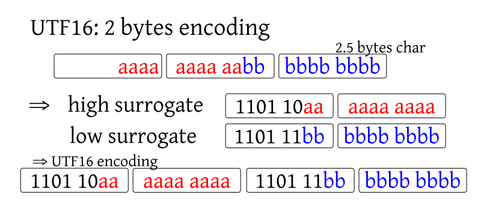

# Prologue

---

## Clarification 1: debug/release build, stack size, cargo

```rust
fn count_calls(n: u64) -> u64 {
    println!("{:p}", &n);
    if n < 1 {
        0
    } else {
        1 + count_calls(n - 1)
    }
}

fn main() {
    println!("{}", count_calls(174470))
}
```

---

## Clarification 1: debug/release

```
% cargo run
…
0x7ffc9324f6b0
0x7ffc9324f610
0x7ffc9324f570

thread 'main' has overflowed its stack
fatal runtime error: stack overflow
[1]    11645 abort      cargo run
```

⇒ result of last time: 160 bytes per stackframe

---

## Clarification 1: debug/release

```
% cargo run --release
…
0x7ffe628fe5a8
0x7ffe628fe548
0x7ffe628fe4e8

thread 'main' has overflowed its stack
fatal runtime error: stack overflow
[1]    11803 abort      cargo run --release
```

⇒ 96 bytes per stackframe

---

## Clarification 1: debug/release

“The Manifest Format” via [Cargo book](https://doc.rust-lang.org/cargo/reference/manifest.html#the-profile-sections)

```
# The development profile, used for `cargo build`.
[profile.dev]
# controls the `--opt-level` the compiler builds with.
# 0-1 is good for debugging. 2 is well-optimized. Max is 3.
# 's' attempts to reduce size, 'z' reduces size even more.
opt-level = 0

# (u32 or bool) Include debug information (debug symbols).
# Equivalent to `-C debuginfo=2` compiler flag.
debug = true

# Link Time Optimization usually reduces size of binaries
# and static libraries. Increases compilation time.
# If true, passes `-C lto` flag to the compiler, and if a
# string is specified like 'thin' then `-C lto=thin` will
# be passed.
lto = false

# The release profile, used for `cargo build --release`
# (and the dependencies for `cargo test --release`,
# including the local library or binary).
[profile.release]
opt-level = 3
debug = false
lto = false

# The testing profile, used for `cargo test` (for `cargo
# test --release` see the `release` and `bench` profiles).
[profile.test]
opt-level = 0
debug = 2
lto = false

# The benchmarking profile, used for `cargo bench` (and the
# test targets and unit tests for `cargo test --release`).
[profile.bench]
opt-level = 3
debug = false
lto = false
```

---

## Clarification 1: debug/release

debug build (160 bytes, 2.4MB):

```
% ls -l ./target/debug/buildtest 
-rwxrwxr-x 2 user user 2514680 Dec 17 22:15 ./target/debug/buildtest
```

release build (96 bytes, 2.4MB):

```
% ls -l ./target/release/buildtest 
-rwxrwxr-x 2 user user 2497912 Dec 17 22:22 ./target/release/buildtest
```

---

## Clarification 1: debug/release

Old `Cargo.toml`:

```
[package]
name = "buildtest"
version = "0.1.0"
authors = ["meisterluk <admin@lukas-prokop.at>"]
edition = "2018"

# See more keys and their definitions at https://doc.rust-lang.org/cargo/reference/manifest.html

[dependencies]
```

---

## Clarification 1: debug/release

New `Cargo.toml`:

```
[package]
name = "buildtest"
version = "0.1.0"
authors = ["meisterluk <admin@lukas-prokop.at>"]
edition = "2018"

# See more keys and their definitions at https://doc.rust-lang.org/cargo/reference/manifest.html

[profile.release]
opt-level = 3
debug = true
lto = true

[dependencies]
```

---

## Clarification 1: debug/release

custom release build (always opt-level=3)

* <code style="font-size:1.8rem">debug=true, lto=false</code>:<br/> 96 bytes stackframe &amp; 2507520 bytes executable
* <code style="font-size:1.8rem">debug=true, lto=true</code>: 96 &amp; 974440 bytes
* <code style="font-size:1.8rem">debug=false, lto=true</code>: 96 &amp; 965904 bytes

I don't know how to go below 96 bytes stack frames.

---

## Clarification 2: `PartialEq` and `Eq`

<div style="text-align: left">
<p><code>PartialEq</code></p>
<dl>
<dt>symmetric</dt><dd><code>a == b</code> implies <code>b == a</code>; and</dd>
<dt>transitive</dt><dd><code>a == b</code> and <code>b == c</code> implies <code>a == c</code>.</dd>
</dl>
<p><code>Eq</code></p>
<dl>
<dt>additionally reflexive</dt><dd><code>a == a</code>;</dd>
</dl>
</div>

---

## Clarification 2: `PartialEq` and `Eq`

```rust
use std::f64;
fn main() {
    println!("{}", f64::NAN == f64::NAN); // false
}
```

⇒ If you implement `PartialEq` then `#[derive(Eq)]` as well unless you can’t

Related traits: `Hash`, `PartialOrd`, `Ord`

# Dialogue: Unicode

---

## Unicode

Unicode maps numbers to *code points*.

Unicode 12.1 maps numbers to 137,994 unicode code points.

How can we encode 137,994 Unicode code points to bytes? ⇒ Unicode Transformation Format (UTF).

---

<span style="font-size:120px"><ruby>令<rt>れい</rt>和<rt>わ</rt></span> ⇒ 

* 2019/04/30: Emperor Akihito abdicated. 2019/05/01: Emperor Naruhito ascended the throne. [1 character added in 12.1](http://blog.unicode.org/2019/05/unicode-12-1-en.html)
* Previously <ruby>平<rt>へい</rt>成<rt>せい</rt></ruby> ⇒ ㍻: <span style="background-color:#ddd">U+5E73 CJK UNIFIED IDEOGRAPH-5E73</span> and <span style="background-color:#ddd">U+6210 CJK UNIFIED IDEOGRAPH-6210</span> merged into <span style="background-color:#ddd">U+337B SQUARE ERA NAME HEISEI</span>

---

## Unicode

I came up with some UTF.
I will introduce 5 versions of a “Complementary Properties Encoding” (CPE).
Let's discuss its properties.

---

## CPE5

2 bytes = 16 bits. Fixed-width encoding. What are potential problems?


---

## CPE4


---

## CPE3


---

## CPE2


---

## CPE1


---

## UTF-8


---

## UTF-8 properties

<dl>
<dt>Backward/ASCII compatibility</dt>
<dd>Setting one special bit of single byte, we have 7 remaining bit with same assignment like ASCII</dd>
<dt>Extended ASCII detection/fallback</dt>
<dd>UTF-8 multibyte strings are rarely linguistically legit Extended ASCII strings.<br>þ ⇒ þ, ø ⇒ ø, ß ⇒ ß</dd>
<!-- >>> 'þ'.encode('utf-8').decode('cp1252')
'þ'
>>> 'ø'.encode('utf-8').decode('cp1252')
'ø'
>>> 'ß'.encode('utf-8').decode('cp1252')
'ß'
-->
<dt>Prefix freedom</dt>
<dd>There is no whole code word in the system that is a prefix of any other code word in the system</dd>
</dl>

---

## UTF-8 properties

<dl>
<dt>Self-synchronization</dt>
<dd>If we jump to some byte, we can easily determine the start of the next character</dd>
<dt>Sorting order</dt>
<dd>Lexicographical order of bytes equal unicode codepoint order</dd>
</dl>

via [Wikipedia](https://en.wikipedia.org/wiki/UTF-8#Description)

---

## UTF-8 fallback example


[UTF-8 encoded Japanese Wikipedia rendered in cp1252](https://en.wikipedia.org/wiki/Mojibake#/media/File:Mojibakevector.png)

---

## UTF-8 fallback example

```rust
use std::fs::File;
use std::io::prelude::*;

fn main() -> std::io::Result<()> {
    let mut fd = File::create("pile_of_poo.html")?;
    fd.write(b"<!DOCTYPE html>\n<head><title>\
\xf0\x9f\x92\xa9</title>\n")?;
    Ok(())
}
```

---

## UTF-8 fallback example

```rust
use std::fs::File;
use std::io::prelude::*;

fn main() -> std::io::Result<()> {
    let mut fd = File::create("mojibake.html")?;
    fd.write(b"<!DOCTYPE html>\n<head><title>\xda \
\xf0\x9f\x92\xa9</title>\n")?;
    Ok(())
}
```

---

## UTF-8 fallback example


---

## UTF-8 fallback example


---

## CPE

<table>
<thead>
<tr><td>version</td><td>ASCII compat</td><td>fallback</td><td>prefix-free</td><td>self-sync</td><td>sort</td></tr>
</thead>
<tbody>
<tr><td>5</td><td>❌</td><td>?</td><td>✓</td><td>❌</td><td>✓</td></tr>
<tr><td>4</td><td>✓</td><td>?</td><td>❌</td><td>❌</td><td>❌</td></tr>
<tr><td>3</td><td>✓</td><td>?</td><td>✓</td><td>❌</td><td>❌</td></tr>
<tr><td>2</td><td>❌</td><td>?</td><td>✓</td><td>❌</td><td>✓</td></tr>
<tr><td>1</td><td>✓</td><td>?</td><td>✓</td><td>✓</td><td>❌</td></tr>
</tbody>
</table>

---

## Unicode / UTF-8 terminology

<dl>
<dt>Mojibake</dt>
<dd>Character rendered in wrong encoding</dd>
<dt>Han unification</dt>
<dd>Korean and Japanese writing systems are based on Chinese characters ⇒ huge overlap ⇒ merge different writing systems</dd>
<dt>Overlong encoding</dt>
<dd>Remove leading zeros in your binary string. Then cram those bits into 1-4 UTF-8 bytes; as <em>few</em> as needed! If you take more bytes, you have overlong encoding; which is disallowed.</dd>
</dl>

---

## UTF-8


---

## Unicode: Han Unification

> One possible rationale is the desire to limit the size of the full Unicode character set, where CJK characters as represented by discrete ideograms may approach or exceed 100,000 characters. Version 1 of Unicode was designed to fit into 16 bits and only 20,940 characters (32%) out of the possible 65,536 were reserved for these CJK Unified Ideographs.

---

## Unicode: Han Unification


---

## Unicode: Han Unification

TRON Code is a multi-byte character encoding used in the TRON project. It is similar to Unicode but does not use Unicode's Han unification process: each character from each CJK character set is encoded separately, including archaic and historical equivalents of modern characters

via [Wikipedia: TRON encoding](https://en.wikipedia.org/wiki/TRON_(encoding))

---

## Unicode / UTF-8 terminology

<dl>
<dt>Surrogates</dt>
<dd><em>In UTF16:</em> Extension to encode 2.5 bytes in a 2 bytes fixed-width encoding.<br/>
<em>In UTF8:</em> Invalid bit patterns for compatibility with UTF16.</dd>
<dt>Basic Multilingual Plane</dt>
<dd>Plane of common use characters (65,536 code points)</dd>
</dl>

---

## Unicode: Surrogates



compare with [Wikipedia](https://en.wikipedia.org/wiki/UTF-16#Examples)

---

## Unicode


via [twitter](https://twitter.com/zorinaq/status/1016538938154967040)

---

## Unicode

1. [shapecatcher.com](http://shapecatcher.com/)
2. [joelonsoftware.com: The Absolute Minimum Every Software Developer Absolutely, Positively Must Know About Unicode and Character Sets](https://www.joelonsoftware.com/2003/10/08/the-absolute-minimum-every-software-developer-absolutely-positively-must-know-about-unicode-and-character-sets-no-excuses/)

---

## UTF-8 in rust

```rust
const TEXT: &str = "Héllö Wør̶l̶d";

fn main() {
    println!("{}", TEXT);
}
```

---

## `String`

```rust
fn main() {
    let s = String::from("Hello Graz");
    println!("{}", s);
}
```

---

## `String`

```rust
fn main() {
    // let s = String::with_capacity(11);
    let s = String::from("Hello Graz");
    s += "!";  // also:  s.push_str("!");
    println!("{}", s);
}
```

Does it compile? <span class="fragment">No, it's immutable.</span>

---

## `String`

```rust
fn main() {
    let mut s = String::from("Hello Graz");
    s += "!";
    println!("{}", s);
}
```

Does it compile? <span class="fragment">Yes.</span>

---

## `String`

* data must be valid UTF-8 string
* owns its data (dropping `String` means deallocate data)
* ⇒ “owned string”
* does not implement Copy, thus move semantics apply
* consists of {&amp;data, length, capacity}

---

## `String`

```rust
// \xD8 is a surrogate code point
fn main() {
    let s = String::from("Hello\xD8Graz!");
    println!("{}", s);
}
```

---

## `String`

```
error: this form of character escape may only
       be used with characters in the range [\x00-\x7f]
 --> src/main.rs:3:32
  |
2 |     let s = String::from("Hello\xD8Graz!");
  |                                ^^^^
```

---

## `String`

```rust
fn sub(arg: String) {
    println!("{}", arg);
}

fn main() {
    let s = String::from("Hello Graz");
    sub(s);
    println!("{}", s);
}
```

Does it compile?

---

## `String`

```
error[E0382]: borrow of moved value: `s`
 --> src/main.rs:8:20
  |
6 |     let s = String::from("Hello Graz");
  |         - move occurs because `s` has type
  |           `std::string::String`, which does
  |           not implement the `Copy` trait
7 |     sub(s);
  |         - value moved here
8 |     println!("{}", s);
  |                    ^ value borrowed here after move
```

---

## `&str`

* data must be valid UTF-8 string
* stored in .data/.rodata, does not deallocate
* ⇒ “borrowed string”, lives as long as the program
* consists of {&amp;data, length}

---

## `&str`: Syntax

```rust
fn main() {
    let s = "H\x65\u{6C}lo \
             Graz";
    println!("{}", s);
}
```

---

## `&str`: Syntax

```rust
fn main() {
    println!("\u{1F4A9}");
}
```

💩

---

## `&str`

```rust
fn main() {
    let s: &str = "Hello Graz";
    s += "!";
    println!("{}", s);
}
```

---

## `&str`

```
error[E0368]: binary assignment operation
    `+=` cannot be applied to type `&str`
 --> src/main.rs:3:5
  |
3 |     s += "!";
  |     -^^^^^^^
  |     |
  |     cannot use `+=` on type `&str`
```

---

## `&str`

```rust
fn sub(arg: &str) {
    println!("{}", arg);
}

fn main() {
    let s: &str = "Hello Graz!";
    sub(s);
    println!("{}", s);
}
```

Does it compile? <span class="fragment">Yes.</span>

----

## `&str`

```rust
fn main() {
    let s = "Hello Graz!";
    let b = "Hello Graz!";
    println!("{:p} {:p}", s, b);
    // 0x557ab7f09cc0 0x557ab7f09cc0
}
```

---

## memory size

```rust
use std::mem;

fn main() {
    println!("{}", mem::size_of::<A>());
}
```

where `A` is `u8` (1), `u32` (4), `f64` (8), `&u8` (8), `String` (24), `&str` (16), `Vec<u8>` (24) or `&[char]` (16).

---

## Other types

* `Vec<u8>` can contain an arbitrary non-UTF-8 string
* `char` is always 4 bytes and thus can contain any UTF-8 code point
* `[u8]` is a slice of `u8`. Cumbersome to handle
* `OsString`, ffi::CString … if you need compatibility strings.

---

## String operations

```rust
fn main() {
    println!("{}", "ß".to_uppercase());
}
```

Output: <span class="fragment">SS</span>

Compare with [Unicode casemap F.A.Q.](http://unicode.org/faq/casemap_charprop.html#11)

---

## string's lifetime

```rust
fn main() {
    let s = {
        let alt: &str = "Graz";
        alt
    };
    println!("{}", s);
}
```

Does it compile? <span class="fragment">Yes.</span>

---

## string's lifetime

```rust
fn main() {
    let s = {
        let alt: String = "Graz".to_string();
        alt
    };
    println!("{}", s);
}
```

Does it compile? <span class="fragment">Yes.</span>

---

## string's lifetime

```rust
fn main() {
    let s = {
        let alt: String = "Graz".to_string();
        alt.as_str()
    };
    println!("{}", s);
}
```

Does it compile?

---

## string's lifetime

```rust
error[E0597]: `alt` does not live long enough
 --> src/main.rs:4:9
  |
2 |     let s = {
  |         - borrow later stored here
3 |         let alt: String = "Graz".to_string();
4 |         alt.as_str()
  |         ^^^ borrowed value does not live long enough
5 |     };
  |     - `alt` dropped here while still borrowed
```

---

## `Deref` trait magic

```rust
fn takes_str(s: &str) {}

let s = String::from("Hello");

takes_str(&s);
```

via [std::string::String](https://doc.rust-lang.org/std/string/struct.String.html)

---

## Indexing

```rust
fn main() {
    let mut s = "合気道";
    println!("{}", s[1]);
}
```

---

## Indexing

```rust
error[E0277]: the type `str` cannot be indexed by `{integer}`
 --> src/main.rs:3:20
  |
3 |     println!("{}", s[1]);
  |                    ^^^^
  | string indices are ranges of `usize`
```

---

## Indexing

```rust
fn main() {
    let mut s = "合気道".chars();
    println!("{}", s.nth(1).unwrap()); // 気
}
```

---

## Indexing

```rust
fn main() {
    for s in "देवनागरी".chars() {
        println!("{}", s);
    }
}
```

```
द
े
व
न
ा
ग
र
ी
```

---

## Unicode

Interesting read: [Stackoverflow “Why does modern Perl avoid UTF-8 by default?”](https://stackoverflow.com/q/6162484)


# Epilogue

---

## Quiz

<dl>
<dt>ASCII is a __-bit encoding</dt>
<dd class="fragment">ASCII is a 7-bit encoding</dd>
<dt>Maximum number of bytes of a UTF-8 code point?</dt>
<dd class="fragment">4</dd>
<dt>Which string types does rust define?</dt>
<dd class="fragment"><code>&amp;str</code>, <code>String</code></dd>
<dt><code>std::mem::size_of::&lt;char&gt;()</code> gives?</dt>
<dd class="fragment">4</dd>
<dt>How to iterate over characters of a string?</dt>
<dd class="fragment"><code>let mut s = "Hello world".chars();</code></dd>
</dl>

---

## Next session

Wed, 2019/01/29 19:00

Topic: traits

---

# Thanks!
